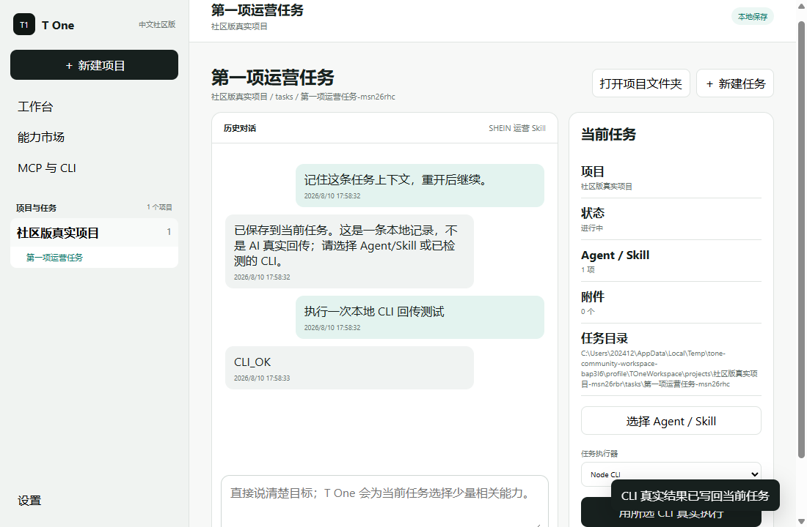

# T One 中文社区版

**给跨境电商、外贸与一人公司的本地优先 AI 经营工作台。不会用代码也能安装。**

[⬇ 下载 Windows 中文安装包](https://github.com/alisanmtd-oss/T-one/releases/latest) · [查看源码](https://github.com/alisanmtd-oss/T-one) · [English](README.en.md) · [问题反馈](https://github.com/alisanmtd-oss/T-one/issues)

> 普通用户不需要下载 GitHub 源码，也不需要安装 Python。进入 Release，下载 `T-One-Community-Setup-*.exe`，双击后选择安装位置，按向导完成即可。



## 三步安装

1. 打开 [最新版本下载页](https://github.com/alisanmtd-oss/T-one/releases/latest)。
2. 在 **Assets / 资源** 中下载 `T-One-Community-Setup-*.exe`。
3. 双击安装包，选择安装目录；安装完成后从桌面或开始菜单打开 **T One 中文社区版**。

安装包包含卸载程序，可从 Windows“已安装的应用”正常卸载。公开社区版不要求命令行，不会静默安装到系统盘固定位置。

## 你可以看到什么

- 中文项目工作区：真实新建本地项目和任务，每个项目一个文件夹。
- 中文能力市场：把 **Agent、Skill、MCP、CLI** 分成四类，再按用途筛选。
- 任务历史与资料：对话、附件、结果、回执和记忆按任务隔离，关闭重开仍可继续。
- 本地能力编排：把公开 Agent 和 Skill 加入当前任务，不把全部 Skill 内容塞进每次对话。
- MCP / CLI 管理：可登记自己的 MCP 地址和 CLI 命令；保存、检测与真实连接状态分开显示。已检测 CLI 可由当前任务明确调用，真实输出写回任务历史；MCP 只在点击测试时联网。
- 公开知识包：SHEIN、Shopee、Lazada、Walmart、Etsy、eBay、B2B 等已脱敏规则与工作流。
- 项目、平台、站点、店铺模式、店铺、账号和执行身份隔离的公开领域模型。

能力状态不会混写：

| 状态 | 代表什么 |
| --- | --- |
| **已包含** | 能力随社区版公开提供，可在离线示例中查看或分配。 |
| **需要配置** | 有公开接口合同，但需要用户自己的合法环境或凭据。 |
| **未配置 / 未检测** | 没有建立连接，不能当成可用。 |
| **规划中** | 只有设计或路线图，不冒充已经实现。 |

## 公开版与完整产品的边界

这个仓库发布的是可审查、可安装的社区核心和离线中文演示，采用 Apache-2.0 许可证。

公开版包含：

- 低依赖 Python 社区核心；
- 可选择目录安装的 Windows 中文安装包；
- 合成配置、公开测试和脱敏知识包；
- Agent / Skill / MCP / CLI 分类界面；
- 项目、任务、历史、附件和能力选择的本地桌面运行时；
- 使用 Windows 系统加密保护可选连接 Token，页面不回显；
- 审批、证据、作用域和连接状态合同。

公开版不包含：

- 真实店铺、客户、供应商、员工和财务数据；
- 密码、Token、Cookie、浏览器环境和身份资料；
- 私有商业连接器、无人值守电脑控制运行时和内部经营证据；
- 自动店铺写入、外联、广告花费、付款、发货或退款。

因此，MCP 和 CLI 可以由用户自己登记；“已保存”“已检测”和“已连接”是不同状态，不会用按钮冒充已经连接。

## 开发者运行

```powershell
git clone https://github.com/alisanmtd-oss/T-one.git
cd T-one
python -m venv .venv
.\.venv\Scripts\python -m pip install .
.\.venv\Scripts\python -m unittest discover -s tests -v
```

Windows 桌面运行时源码位于 `desktop_public/`，固定 Electron 与 electron-builder 版本，可由公开 GitHub Actions 重复构建。普通用户只需下载安装包，不需要运行源码。

## 目录

| 路径 | 内容 |
| --- | --- |
| `ai_ecommerce_director/` | 项目、店铺、任务、审批、证据和知识包公开核心 |
| `knowledge_packs/` | 已脱敏平台与业务知识包 |
| `desktop_public/` | 中文本地工作区、能力市场、连接管理与 NSIS 安装配置 |
| `config/` | 合成示例和公开安全配置 |
| `tests/` | 公开行为、安装、状态和边界回归 |
| `docs/` | [能力状态](docs/CAPABILITY_STATUS.md)、[文件说明](docs/FILE_GUIDE.md)、[架构](docs/ARCHITECTURE.md) |

## 参与项目

- 提问题或建议：[GitHub Issues](https://github.com/alisanmtd-oss/T-one/issues)
- 贡献代码：[CONTRIBUTING.md](CONTRIBUTING.md)
- 安全问题：[SECURITY.md](SECURITY.md)
- 发布路线：[ROADMAP.md](ROADMAP.md)
- Codex 配套项目：[Codex × T One Operator Skill](https://github.com/alisanmtd-oss/codex-t-one-skill)

## 许可证

Apache License 2.0，详见 [LICENSE](LICENSE)。
