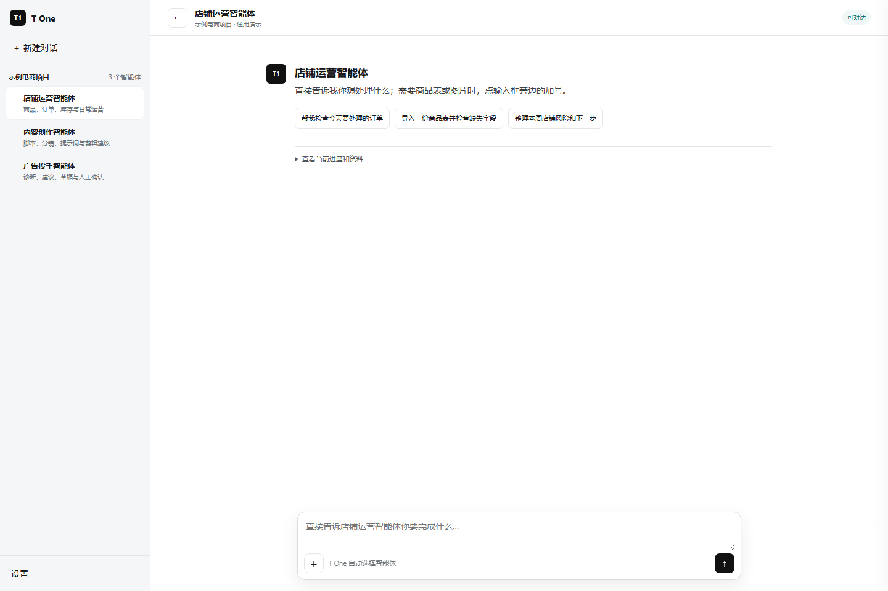
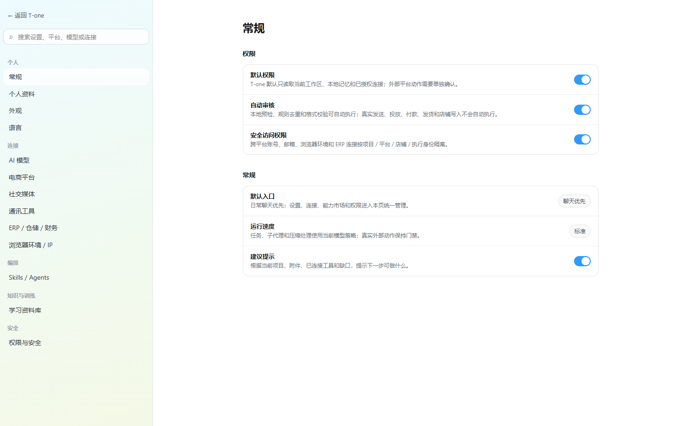

# T One

**面向多项目、多平台、多店铺团队的本地优先商业运营中枢。**

[English](README.md) | [能力状态](docs/CAPABILITY_STATUS.md) | [文件说明](docs/FILE_GUIDE.md) | [路线图](ROADMAP.md)

T One 用一套长期业务上下文组织平台电商、独立站、B2B 获客、主动开发、
内容与广告、财务、风控和审批：

`工作区 -> 项目 -> 平台 -> 真实店铺或业务容器 -> 长期主对话 -> 工作流`

T One 不是“所有平台、ERP、收款工具和通讯软件都已经连接”的宣传壳。
当前公开仓库是经过脱敏的社区核心，不包含真实店铺凭据、客户资料、浏览器环境、
私有连接器和执行证据。



## 产品方向

- 一个项目可以包含多个平台和多家真实店铺。
- 一家店铺或一个业务容器保留一段长期主对话。
- Listing、库存、订单、广告、内容、财务和客服是主对话里的工作流，不再制造重复侧栏智能体。
- 没有绑定真实店铺的平台，不进入经营数据和实时大盘。
- 法律、版权、财务、审批、证据和连接器治理作为共享能力，只建设一次。
- 店铺写入、广告花费、付款、发货、退款、外联、身份、银行和 MFA 必须经过负责人确认。

## 当前哪些能用

本仓库使用四种严格状态：

| 状态 | 含义 |
| --- | --- |
| **已验证** | 已实现，并通过公开测试或公开演示验证。 |
| **需要配置** | 接口或本地能力已实现，但需要用户自己的合法凭据或运行环境。 |
| **部分实现** | 有可复用基础，但完整业务闭环尚未完成。 |
| **未连接 / 规划中** | 只有文档、结构或设计，不能当成真实连接。 |

| 能力 | 状态 | 公开证据 |
| --- | --- | --- |
| 本地 Python 社区核心 | **已验证** | 包、测试、合成数据 |
| 项目 / 平台 / 店铺 / 任务隔离 | **已验证** | 领域模型与回归测试 |
| 对话优先浏览器参考界面 | **已验证** | 合成演示，不含真实店铺 |
| 知识包注册与读取 | **已验证** | 已脱敏公开知识包 |
| 审批与证据合同 | **已验证** | 本地合同与测试 |
| 本地模型和供应商配置合同 | **部分实现** | 不附带任何模型凭据 |
| 平台和 ERP 读取 | **需要配置** | 有接口合同，没有公开真实账号 |
| 平台写入和广告执行 | **未连接 / 规划中** | 保持审批门禁 |
| Gmail、Outlook、WhatsApp、微信、Telegram、飞书 | **未连接 / 规划中** | 没有公开 OAuth 或实时连接器 |
| PayPal、连连、万里汇等资金结算 | **未连接 / 规划中** | 当前仅有财务结构 |
| Windows 正式桌面程序 | **私有产品，不在本仓库** | 公开截图仅说明交互方向 |

评估或接入前，请先读 [docs/CAPABILITY_STATUS.md](docs/CAPABILITY_STATUS.md)。

## 公开核心与私有产品的边界

公开仓库包含：

- 低依赖 Python 社区核心；
- 合成配置与测试数据；
- 脱敏后的平台知识包；
- 浏览器参考界面；
- 审批、证据、路由和隔离合同；
- 测试、社区文件和发布完整性清单。

公开仓库不包含：

- 真实店铺、客户、供应商、员工和财务数据；
- 密码、Token、Cookie、浏览器环境、身份证明；
- 私有 Windows 桌面运行时和商业连接器；
- 不受控的店铺写入、外联、投放、付款和发货；
- 私有提示词、内部证据库和原始会话记录。

## 组织与系统结构

```text
Owner / 投资与项目决策者
  -> 集团经营中枢 / PMO
    -> 事业组组长
      -> 部门主管
        -> 岗位智能体与可复用 Skills

事业组
  - 平台经营
  - 独立站
  - B2B 平台获客
  - 主动开发客户
  - 内容与广告
  - 共享财务、法律、证据、审批和连接器
```

所有平台授权和外部执行身份都必须按项目、平台、国家站点、店铺模式和真实店铺隔离。

## 快速开始

```powershell
git clone https://github.com/alisanmtd-oss/T-one.git
cd T-one
python -m venv .venv
.\.venv\Scripts\python -m pip install --upgrade pip
.\.venv\Scripts\python -m pip install .
.\.venv\Scripts\python -m compileall -q ai_ecommerce_director
.\.venv\Scripts\python -m unittest discover -s tests -v
```

打开 `demo/chat-first-workspace.html` 可以查看合成数据演示。它不会连接真实店铺，
也不会执行外部动作。

## 文件目录说明

| 路径 | 内容 |
| --- | --- |
| `ai_ecommerce_director/` | 公开 Python 领域模型、路由、证据、审批和知识包 API |
| `knowledge_packs/` | 已脱敏的平台与业务知识资产 |
| `config/` | 合成示例和公开安全注册表 |
| `demo/` | 只使用合成数据的浏览器参考界面 |
| `docs/` | 架构、文件说明、状态真值和知识包说明 |
| `scripts/` | 公开校验和发布完整性工具 |
| `tests/` | 公开行为与安全边界回归测试 |
| `.github/` | Issue、PR 和社区工作流 |

详细说明见 [docs/FILE_GUIDE.md](docs/FILE_GUIDE.md)。

## 界面截图

截图用于展示交互方向，不代表某个平台或 ERP 已经真实接通。



## 下一版本方向

下一公开版本优先完成：

1. 稳定的 Skill、插件和连接器清单；
2. 带可撤销权限的本地 MCP/API；
3. 能返回明确错误的供应商连接测试；
4. 先完成只读平台与 ERP 适配，再考虑写入；
5. 按平台、站点、店铺模式、主体税务、履约和规则版本拆分结算与成本结构；
6. 耐久任务、证据、审批和失败恢复；
7. 更清楚的安装、兼容性和验收说明。

完整顺序和明确不做的内容见 [ROADMAP.md](ROADMAP.md)。

## Codex 配套 Skill

独立项目 **[Codex × T One Operator Skill](https://github.com/alisanmtd-oss/codex-t-one-skill)**
用来教 Codex 正确识别、配置、操作和验收
T One，避免把草稿、计划和真实连接混为一谈。它与 T One 主仓库分开发布，
便于运行时和操作规则独立迭代。

## 安全与贡献

- 不提交真实凭据、个人资料、店铺、客户、供应商或财务数据。
- 页面按钮、结构、研究报告或单元测试不能单独证明“已经连接”。
- 未知仓库和连接器必须先做许可证与安全审查。
- 一切外部副作用必须经过人工确认。

请阅读 [CONTRIBUTING.md](CONTRIBUTING.md)、[SECURITY.md](SECURITY.md)、
[GOVERNANCE.md](GOVERNANCE.md) 和 [SUPPORT.md](SUPPORT.md)。

## 许可证

Apache License 2.0，详见 [LICENSE](LICENSE)。
